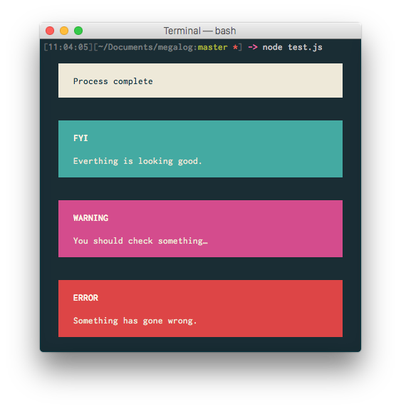

# megalog

Output messages to the console in big blocks; for when you really need something to be noticed.



## Install

```
$ npm install --save megalog
```

## Usage

Use in place of `console` in node/io.js:

```js
var megalog = require('./megalog');

megalog.log("Process complete");
megalog.info("Everthing is looking good.");
megalog.warn("You should check something…");
megalog.error("Something has gone wrong.");
```

## Build

```
$ npm install
$ npm run build
```